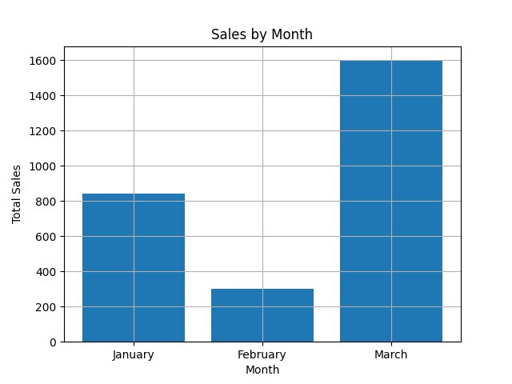

# SQL E-commerce Sales Analysis

## 📊 Project Overview
This project analyzes an e-commerce dataset using SQL to extract business insights related to sales, customers, and product performance.

## 🧠 Skills Demonstrated
- JOINs across multiple tables
- GROUP BY and aggregations (SUM, AVG)
- Subqueries for advanced filtering
- CASE WHEN for customer segmentation

## 📁 Project Structure
- schema/ → database schema (table creation)
- data/ → sample dataset
- analysis/ → SQL queries for business insights

## 🚀 Key Insights
- Identification of top spending customers
- Monthly sales performance
- Product-level revenue analysis
- Customer segmentation (High, Medium, Low value)

## 📈 Sales by Month

## 📌 Concepts Practiced
- Customer segmentation
- Monthly sales analysis
- Ranking customers with window functions
- Comparing aggregates with subqueries

## 🛠️ Tools
- MySQL

## 📌 Notes
This project simulates a real-world e-commerce scenario with structured data and analytical queries.